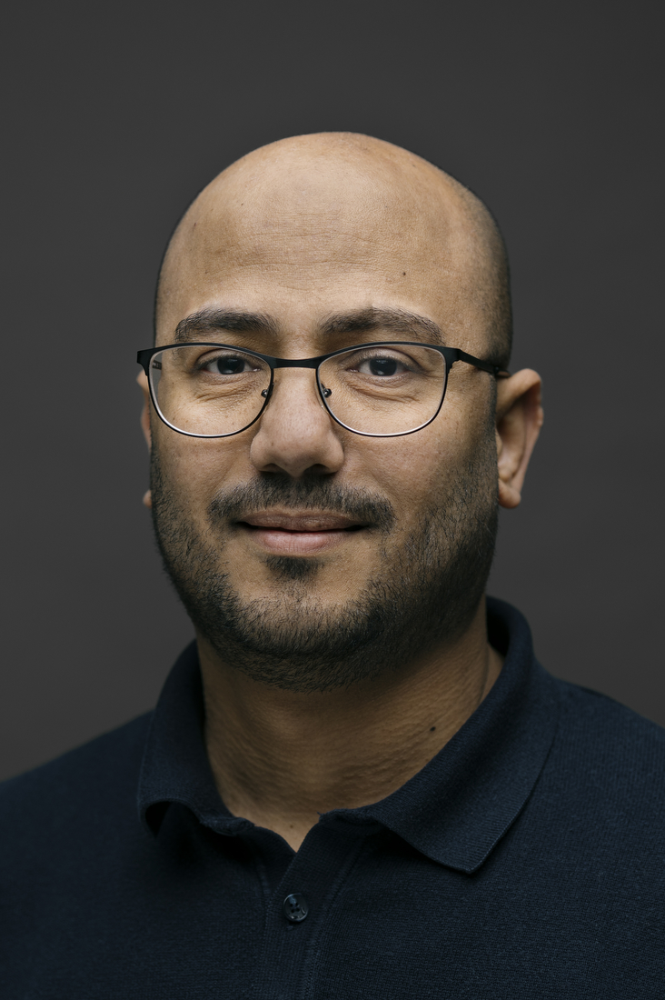

<!-- Font Awesome -->
<link rel="stylesheet" href="https://cdnjs.cloudflare.com/ajax/libs/font-awesome/6.5.0/css/all.min.css">

<!-- ========================= -->
<!-- Profile Section -->
<u>Last update: March 2026</u>

  

    <h2>Dr. Mohamed Fathi Abdallah</h2>
    
Assistant Professor of Food Toxicology

    
Department of Food Science, Aarhus University, Denmark

    
Advancing food toxicology through cutting-edge research on natural toxins, emerging contaminants, and mixture risk assessment.

    
<i class="fa-solid fa-users-line icon-accent"></i> Accepting Master's and PhD students.

   
    
<i class="fa-solid fa-envelope-circle-check icon-accent"></i> Contact:
      <a href="mailto:mfa@food.au.dk">mfa@food.au.dk</a>
    

  

  

<!-- ========================= -->
<!-- Positions & Affiliations -->

  <h3 class="section-title"><i class="fa-solid fa-building-columns"></i> Other Positions & Affiliations</h3>
  <ul>
    <li>Scientific Expert (Food Contaminantes) for the Joint FAO/WHO Expert Committee on Food Additives (JECFA).</li>
    <li>Board Member of the European Society of Toxicology In Vitro (ESTIV).</li>
    <li>Expert Group Member (Natural Toxins), ILSI Europe.</li>
    </ul>

<!-- ========================= -->
<!-- Research Interests -->

  <h3 class="section-title"><i class="fa-solid fa-flask-vial"></i> Research Interests</h3>
  
The AU FOOD TOX group focuses on understanding the health risks associated with natural toxins, particularly mycotoxins and cyanotoxins, as well as emerging contaminants in novel foods.

Using advanced analytical techniques such as liquid chromatography–tandem mass spectrometry (LC–MS/MS) together with in vitro models, the group investigates both the occurrence and toxic effects of these compounds. Special attention is given to their combined effects, as exposure to mixtures better reflects real-life conditions in food systems.

Through this interdisciplinary approach, AU FOOD TOX seeks to provide a clearer understanding of how foodborne contaminants affect human health and to contribute to robust, evidence-based risk assessment.

  <ul>
    <li>Detection of natural food contaminants (postgraduate students, PhDs, Postdocs)</li>
    <li>Mixture toxicology with a focus on food contaminants using NAMs (postgraduate students, PhDs, Postdocs)</li>
  </ul>

<!-- ========================= -->
<!-- Scholarships & Fellowships -->

  <h3 class="section-title">
    <i class="fa-solid fa-award"></i> Scholarships & Fellowships Support
  </h3>

  

    We actively support applications for <strong>competitive national and international
    scholarships and fellowships</strong>. Highly motivated candidates are encouraged to
    contact us for guidance on <strong>proposal writing</strong> and
    <strong>research topic development</strong>.
  

  <ul class="scholarship-list">
    <li>
      EU
      <strong>Marie Curie Actions (MSCA)</strong>
    </li>
    <li>
      National
      <strong>Danish Council for Independent Research (DFF)</strong>
    </li>
    <li>
      International
      <strong>Novo Nordisk Foundation</strong>
    </li>
    <li>
      International
      <strong>Villum Foundation</strong>
    </li>
    <li>Other national and international funding schemes</li>
  </ul>

  <a href="mailto:mfa@food.au.dk" class="btn btn-primary">
    <i class="fa-solid fa-envelope"></i> Contact for Fellowship Support
  </a>

<!-- ========================= -->
<!-- Master Thesis / Internship -->

  <h3 class="section-title">
    <i class="fa-solid fa-microscope"></i> Master Thesis & Internship Opportunities at AU FOOD 2025/2026
    NEW
  </h3>

  
We welcome motivated Master students, interns, or Erasmus students to join our research projects:

  <ul class="project-list">
    <li>
      <strong>Mixture Toxicology:</strong>
      
Optimization of a 3D in vitro model to study hepatocytotoxicity of different food contaminants

      <a href="https://food.au.dk/masters-thesis-projects/optimization-of-a-3d-in-vitro-model-to-study-the-hepatocytotoxicity-of-different-food-contaminants"
         target="_blank" rel="noopener" class="btn-outline">View Project</a>
    </li>

    <li>
      <strong>Food AI &amp; Database:</strong>
      
Developing a database of microbial food toxins in the EU (case study on mycotoxins)

      <a href="https://food.au.dk/masters-thesis-projects/developing-a-database-of-microbial-food-toxins-in-the-eu-case-study-on-mycotoxins"
         target="_blank" rel="noopener" class="btn-outline">View Project</a>
    </li>
  </ul>

  
For more information, please contact <strong>Dr. Mohamed Fathi Abdallah</strong> at 
    <a href="mailto:mfa@food.au.dk">mfa@food.au.dk</a>.
  

<!-- ========================= -->
<!-- Announcements -->

  <h2 class="section-title"><i class="fa-solid fa-bullhorn"></i> Announcements</h2>

  

   

      

        <h3>28 February 2026 — New Publication (Editorial)</h3>
        
“ESTIV early career network: A growing initiative to support the next generation of NAMs-oriented toxicologists” 
        is now online in the <em>Toxicology in Vitro</em>.

        
Access the article: <a href="https://www.sciencedirect.com/science/article/pii/S088723332600024X?via%3Dihub" target="_blank" rel="noopener">Click here</a>.

      

      

        
      

    

    

    

      

        <h3>17 October 2025 — New Publication</h3>
        
“Challenges in mycotoxin monitoring in recently independent countries: The case of Kosovo☆” 
        is now online in the <em>Journal of Food Composition and Analysis</em>.

        
Access the article: <a href="https://www.sciencedirect.com/science/article/pii/S0889157525012815" target="_blank" rel="noopener">Click here</a>.

      

      

        
      

    

    

    

      

        <h3>01 October 2025 — PhD Vacancy at AU FOOD</h3>
        
Fully funded 3-year PhD position at the Department of Food Science, Aarhus University. Focus: mass spectrometry-based methods for natural toxins in novel food.

        
More info: <a href="https://www.mfathiabdallah.com/PhD_position1/" target="_blank" rel="noopener">Click here</a>.

      

      

        
      

    

    

    

      

        <h3>30 September 2025 — Novo Nordisk Foundation Grant</h3>
        
Awarded a 5-year RECRUIT Grant from Novo Nordisk Foundation to establish a research group in Food Toxicology, focusing on detection and risk evaluation of natural toxins in novel foods.

      

      

        
      

    

    

    

      

        <h3>01 March 2025 — Joining Aarhus University</h3>
        
Starting April 2025 as a Tenure Track Assistant Professor in Food Toxicology, Department of Food Science, Aarhus University.

      

      

        
      

    

  

  

    

    

      For more news, please <a href="https://www.mfathiabdallah.com/news/" target="_blank" rel="noopener">click here</a>.
    

  

<!-- ========================= -->
<!-- Contact -->

  <h3 class="section-title"><i class="fa-solid fa-paper-plane"></i> Contact</h3>

  

    

      <h4><i class="fa-solid fa-user-tie"></i> Dr. Mohamed Fathi Abdallah</h4>
      

        <i class="fa-solid fa-envelope"></i> Email: <a href="mailto:mfa@food.au.dk">mfa[at]food.au.dk</a> 
        <i class="fa-brands fa-x-twitter"></i> Twitter: <a href="https://twitter.com/MoFathiAbdallah" target="_blank">@MoFathiAbdallah</a> 
        <i class="fa-brands fa-linkedin"></i> LinkedIn: <a href="https://www.linkedin.com/in/mohamed-fathi-abdallah-66126a38/" target="_blank">Mohamed Fathi Abdallah</a>
      

      
    

    

